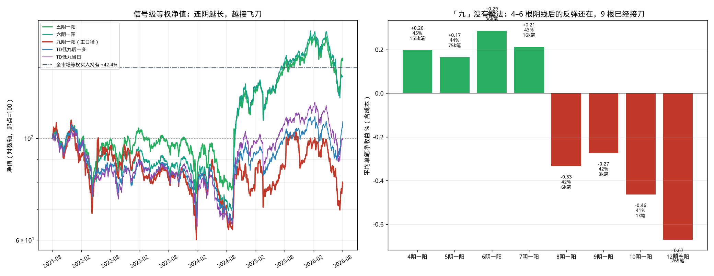

# 专项回测：九空一多

> 用户问题：有一个叫「九空一多」的选股策略，回测一下。

公开资料**没有统一公式**。通达信里能搜到的多是「九转多空 / 神奇九转」，K 线口诀里接近的是「连阴后出首阳」。本回测把能落到日线、不含未来函数的几种定义都跑一遍，主口径取字面：

**前 9 个交易日收阴（收盘 &lt; 开盘），当日收阳（收盘 &gt; 开盘），次日开盘买。**

页面可直接用的中文规则（策略库编号 **33**）：

```
当连续9天阴线后出现阳线时买入；当盈利超过8%或者亏损超过5%时卖出；最长持有10天。
```

解析结果：买入 = `连续 9 天阴线后收阳`；卖出侧无条件，靠止盈 8% / 止损 5% / 最长 10 日。
生成代码：[`strategies/33_九空一多.py`](strategies/33_九空一多.py)

**结论先说：** 九连阴后出一阳，全市场 5 年 3,058 笔，胜率 41.6%，平均单笔 **−0.27%**，等权净值 **−20.4%**。样本内、样本外都是负的。把「九」换成 4–6 根阴线，均值回归还在；数到 9 根，已经是在接飞刀。神奇九转低九同样扣完成本后跑不赢等权持有。



---

## 一、网上在说什么

没有一篇可复现的「九空一多」标准源码。能对上号的有三类：

| 说法 | 落到日线的定义 | 本回测编号 |
| --- | --- | --- |
| 九阴一阳 / 连阴后出首阳 | 前 N 日 K 线收阴，当日收阳 | **A**（N=9 主口径）；4–12 做敏感度 |
| 九连跌后收涨 | 前 9 日收盘连跌，当日收涨（阴线≠下跌） | **B** |
| 神奇九转 / TD Sequential 低九 | 连续 9 日 `收盘 < 4 日前收盘`；有人等第一次 `收盘 > 4 日前收盘` 才买 | **C** 当日买；**D** 低九后「一多」 |

阴线是收盘相对开盘，下跌是收盘相对昨收，两套不是同一件事。编译器里「连续 4 天下跌」（策略 21）走的是后者；这次「九空一多」主口径走前者。

出场与策略 21 对齐，方便比较：止盈 8%、止损 5%、最长 10 个交易日。另测了持有满 5/10 日、下一根阴线卖、站上 MA5 卖。

---

## 二、回测口径

| 项目 | 设定 |
| --- | --- |
| 样本 | 全 A 股 5,404 只、657 万根前复权日线 |
| 区间 | 2021-08-17 ~ 2026-08-17（1,211 个交易日） |
| 买入 | 阳线当日收盘出信号，**次日开盘**成交；一字板买不到 |
| 卖出 | T+1 后，止盈 / 止损 / 到期（或对照规则）→ 次日开盘 |
| 成本 | 手续费 0.5‰ + 滑点 0.5‰，双边，往返约 2‰ |
| 度量 | 信号级等权（每个信号都做）；另报 1000 万 / 单笔 5% / 最多 20 只的资金约束组合 |
| 基准 | 全市场等权买入持有 5 年 **+42.41%** |

引擎 `yinThenYang` 掩码与按 K 线逐根数阴线的结果差 0 格。例：000002 万科Ａ 2023-09-11～09-21 九根阴线，09-22 收阳触发。

---

## 三、主口径：九阴一阳

| 指标 | 数值 |
| --- | --- |
| 信号次数 | 3,064（2,190 只） |
| 次日能开盘成交 | 3,058（99.8%）；一字板买不到仅 5 次 |
| 能买到时次日跳空 | 均值 +0.11%，中位数 0，正跳空 44% |
| 九连阴期间累计涨跌 | 均值 **−14.4%**，中位数 −12.4% |
| 成交 | 3,058 笔 |
| 胜率 | 41.60% |
| 平均单笔 | **−0.27%**（中位数 −2.38%） |
| 盈亏比 | 0.92 |
| 平均持有 | 7.0 日 |
| 等权 5 年 | **−20.36%**（年化 −4.48%，最大回撤 45%，夏普 −0.04） |

卖出原因：止损 1,335 · 到期 1,003 · 止盈 719。平均盈利 +7.59%，平均亏损 −5.87%——止盈上限 8% 几乎摸到，但止损触发更勤。

| 年份 | 笔数 | 胜率 | 平均单笔 |
| ---: | ---: | ---: | ---: |
| 2021 | 136 | 43.4% | −0.21% |
| 2022 | 615 | 38.0% | −0.70% |
| 2023 | 874 | 45.0% | +0.37% |
| 2024 | 594 | 41.9% | +0.27% |
| 2025 | 320 | 49.7% | +0.06% |
| 2026 | 519 | 34.3% | −1.70% |
| 样本内 ～2024-08-16 | 2,106 | 41.7% | **−0.11%** |
| 样本外 2024-08-17～ | 952 | 41.4% | **−0.63%** |

资金约束组合（成交额优先 / 随机挑选）5 年分别 −33.0% / −32.7%，和信号级同方向。

对照：策略 21「四连阴+RSI6&lt;25」同一窗口 94,367 笔，平均 −0.05%、等权 −25.3%。九空一多样本更少、单笔更差。

---

## 四、敏感度：问题出在「九」

同一套止盈止损，只改连阴天数：

| N 阴一阳 | 笔数 | 胜率 | 平均单笔 | 等权 5 年 | 夏普 |
| ---: | ---: | ---: | ---: | ---: | ---: |
| 4 | 155,680 | 44.8% | **+0.20%** | +35.2% | 0.39 |
| 5 | 75,968 | 44.4% | **+0.17%** | **+49.3%** | 0.49 |
| 6 | 36,143 | 44.9% | **+0.29%** | +36.4% | 0.40 |
| 7 | 16,610 | 43.4% | +0.21% | −0.1% | 0.11 |
| 8 | 6,990 | 41.6% | −0.33% | −4.0% | 0.09 |
| **9** | **3,058** | **41.6%** | **−0.27%** | **−20.4%** | **−0.04** |
| 10 | 1,331 | 40.7% | −0.46% | −25.8% | −0.05 |
| 12 | 269 | 35.3% | −0.67% | −34.7% | −0.19 |

连阴越长，越不是「超卖反弹」，越是趋势阴跌。4–6 根时平均单笔略正，五阴一阳等权 +49% 略高于买入持有 +42%；但 2026 年五阴一阳平均仍是 −0.99%，**不是稳定边**。六阴一阳样本内 +0.41%、样本外只剩 +0.01%。数到 8 根以后，单笔转负。

「九」没有魔法，只是把已经变差的均值回归又往下截了一刀。

---

## 五、其它定义与出场、过滤

### 换一种「九空」

| 定义 | 笔数 | 胜率 | 平均单笔 | 等权 5 年 |
| --- | ---: | ---: | ---: | ---: |
| B 九跌一涨 | 3,402 | 48.5% | **+0.94%** | −9.0% |
| C TD 低九当日 | 87,289 | 43.9% | −0.18% | 0.0% |
| D TD 低九后一多 | 83,377 | 45.9% | +0.42% | +8.6% |
| A' 九阴一阳且当日收涨 | 2,801 | 42.0% | −0.19% | −20.4% |

九跌一涨单笔均值为正，但信号扎堆在下跌市，等权净值仍为负。TD 低九后等「一多」确认，是这组里最好的九数定义，5 年也只有 +8.6%，远低于等权持有。

### 同一买入，换出场

| 出场 | 平均单笔 | 等权 5 年 |
| --- | ---: | ---: |
| 止盈 8% / 止损 5% / 最长 10 日（主口径） | −0.27% | −20.4% |
| 持有满 5 日 | +0.02% | −6.1% |
| 持有满 10 日 | −0.20% | +3.4% |
| 下一根阴线卖 | +0.11% | −78.2% |
| 收盘站上 MA5 卖 | −0.97% | −75.1% |

换出场救不了九阴一阳。短持有把周转放大，净值更差。

### 过滤

| 过滤 | 笔数 | 平均单笔 | 等权 5 年 | 说明 |
| --- | ---: | ---: | ---: | --- |
| RSI6&lt;30 / &lt;20 | 1,767 / 788 | −0.22% / −0.47% | −56% / −62% | 越超卖越差 |
| 阳线放量 &gt;1.5× | 214 | +1.43% | +110% | **只有 214 笔**；2021、2026 年为负，不推荐 |
| 阳线缩量 &lt;0.7× | 252 | −1.67% | −84% | 缩量阴跌后续更弱 |
| 流通市值 50–200 亿 | 1,147 | −0.94% | −38% | 更差 |
| 仅沪深主板 | 1,712 | 0.00% | −27% | 不改符号 |
| RSI&lt;30 且放量 | 65 | +2.61% | +0.5% | 样本外平均 −0.20%，过拟合 |

放量过滤的 5 年曲线很好看，样本太小、年份不稳，当作数据挖掘，不当作策略。

---

## 六、结论

1. **按字面做「九空一多」（九连阴后出一阳）在全 A 股 5 年上是负期望。** 3,058 笔足够大，样本内外同号，不是随机噪声。
2. **结构原因是连阴太长。** 九连阴期间股价已经跌了约 14%，次日几乎不跳空。4–6 根阴线后的反弹还在，8 根起单笔转负——「九」正好落在接刀区。
3. **神奇九转低九**（TD Sequential）当日买平均 −0.18%；等第一次 `C > C[4]` 平均 +0.42%、5 年 +8.6%，扣成本后跑不赢等权持有。
4. 页面策略库已加入 **33 九空一多**，规则与本报告主口径一致，方便复跑。不要把「五阴一阳略胜基准」理解成可实盘边：2026 年仍然亏，且没有事先理由只选 5 不选 9。

逐笔与变体表：[`results/33_九空一多_signal_trades.csv`](results/33_九空一多_signal_trades.csv)、[`results/jiukong_variants.csv`](results/jiukong_variants.csv)。复跑：`python3 run_jiukong.py && python3 make_chart_jiukong.py`。
