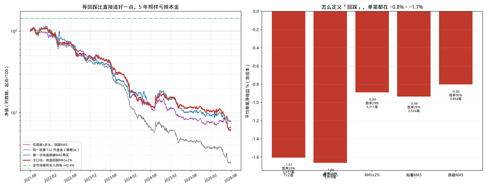

# 专项回测：横盘放量首板后，第一次回踩 5 日线再买

> 策略原话：横盘超过 20 个交易日，突然放量上涨，当前价大于五日线大于十日线大于二十日线，在第一个涨停后第一次回踩五日线介入，跌破十日线离场。

与 [`sideways_lu_report.md`](sideways_lu_report.md)（T+2 开盘追）是同一套选股，**只改买点**：涨停之后不再隔日追，等到第一次回踩 MA5。

**主口径**

| 环节 | 量化 |
| --- | --- |
| 选股 | 与策略 34 相同：涨停前 20 日高低振幅 &lt; 15%、这 20 日无涨停、涨停日量 &gt; 前 5 日均量 2 倍、C &gt; MA5 &gt; MA10 &gt; MA20、昨日非涨停 |
| 回踩五日线 | 涨停日 T 之后，**第一根收盘落在 MA5 ±2%** 的 K 线（与页面「回踩均线」同一带宽） |
| 放弃 | 等待期内收盘先跌破 MA10；或 15 个交易日内回不到 MA5 带 |
| 买入 | 回踩日收盘出信号，**次日开盘** |
| 卖出 | 收盘跌破 MA10，次日开盘 |

页面编译器没有「涨停后再等回踩」的状态机，**不进策略库**。

**结论先说：** 等回踩比 T+2 追好一截（平均 −0.89% vs −1.61%），但符号没翻过来。3,311 笔，胜率 28.8%，等权 5 年 **−93.9%**。样本内 −1.32%、样本外 −0.43%。买在 MA5 附近、卖在跌破 MA10，两条均线只隔几天，多数单子拿 4～5 天就结束，并没有把「横盘蓄势」变成趋势。

---

## 一、口径

| 项目 | 设定 |
| --- | --- |
| 样本 | 全 A 股 5,404 只，2021-08-17 ~ 2026-08-17 |
| 涨停 | 板块上限 + 收盘=最高价 |
| 回踩主定义 | 收盘 ∈ [MA5×0.98, MA5×1.02] |
| 对照定义 | 最低价触及 MA5 且收盘仍在线上；收盘 ∈ [MA5, MA5×1.02]；第一次收盘跌破 MA5（S12 口径） |
| 成本 | 手续费 0.5‰ + 滑点 0.5‰ 双边 |
| 基准 | 全市场等权买入持有 5 年 **+42.41%** |

例：000001 平安银行 2024-02-21 涨停（相对 MA5 +10.7%），02-26 收盘回到 MA5 下方 0.58% 触发回踩，次日开盘买。

---

## 二、主口径结果

3,890 次横盘放量首板里：

| 去向 | 次数 |
| --- | ---: |
| 15 日内回踩到 MA5±2% | **3,318**（85%） |
| 回踩前先跌破 MA10（放弃） | 558 |
| 一直不回踩 | 14 |

涨停→回踩等待中位数 **3 日**（均值 3.4 日），62.5% 在 3 日内完成。回踩日收盘相对 MA5 中位数 +0.50%，确实买在 5 日线附近。

| 指标 | 回踩 MA5（本策略） | T+2 开盘追（策略 34） |
| --- | ---: | ---: |
| 成交 | 3,311 | 3,817 |
| 胜率 | 28.75% | 28.77% |
| 平均单笔 | **−0.89%** | −1.61% |
| 中位数 | −2.30% | −3.21% |
| 平均持有 | 5.2 日 | 7.0 日 |
| 等权 5 年 | **−93.90%** | −97.57% |

资金约束组合 5 年 −72% / −77%。卖出几乎全是跌破 MA10。买入后 23% 的单子 2 日内就平掉。

| 年份 | 笔数 | 胜率 | 平均单笔 |
| ---: | ---: | ---: | ---: |
| 2021 | 292 | 31.5% | +0.10% |
| 2022 | 536 | 25.4% | −1.60% |
| 2023 | 729 | 26.6% | −1.18% |
| 2024 | 367 | 29.4% | −0.25% |
| 2025 | 1,019 | 29.1% | −0.90% |
| 2026 | 368 | 34.0% | −0.69% |
| 样本内 | 1,716 | 26.5% | **−1.32%** |
| 样本外 | 1,595 | 31.2% | **−0.43%** |

仍然只有 2021 年勉强打平。样本外亏得少一些，没有翻正。

---

## 三、为什么回踩也亏

1. **等回踩过滤掉了「直接破位」的 558 次，所以比追 T+2 少亏约 0.7 个百分点。** 这 558 次如果硬追，多半就是策略 34 里亏得最狠的那些。
2. **买点和卖点太近。** 入场在 MA5 附近，出场是跌破 MA10。多头排列里 MA5 只比 MA10 高一点，稍弱两天就触发卖出。平均持有 5.2 日、23% 持有 ≤2 日，吃不到趋势。
3. **回踩经常已经是转弱。** 平安银行那笔：回踩日相对 MA5 −0.58%，次日继续在 MA5 下方——买的是均线失守的第一天，不是均线支撑的确认。

---

## 四、对照：回踩定义、等待期、过滤、出场

| 回踩定义 | 成交 | 胜率 | 平均单笔 | 等权 5 年 |
| --- | ---: | ---: | ---: | ---: |
| T+2 开盘追（不回踩） | 3,817 | 28.8% | −1.61% | −97.6% |
| 最低价触及 MA5，收盘仍在线上 | 2,818 | 25.2% | −1.66% | −99.0% |
| **收盘 MA5±2%（主口径）** | **3,311** | **28.8%** | **−0.89%** | **−93.9%** |
| 收盘 ∈ [MA5, MA5+2%] | 2,526 | 27.8% | −0.94% | −92.6% |
| 第一次收盘跌破 MA5 | 3,864 | 29.9% | −0.80% | −92.1% |
| 跌破 MA5 且当日仍 ≥ MA10 | 3,547 | 28.6% | −0.92% | −91.0% |

「先碰到均线再买、收盘还站上」反而最差：很多是上影线扫到 MA5 后继续弱。S12 那种「跌破 MA5 才买」略好，仍是负的。

最长等待 5 / 10 / 15 / 20 日，平均单笔 −0.80%～−0.90%，几乎无差别。多数回踩 3 天内就会出现。

去掉横盘放量、只保留「首板+多头再回踩」：19,772 笔，平均 −1.05%。裸首板再回踩 34,993 笔，平均 −0.81%。过滤越严，样本越少，符号不变。

换出场：跌破 MA5 −0.48%；止盈 8%/止损 5%/最长 10 日 **−0.08%**；持有满 5 日 −0.27%。止盈止损最接近打平，仍然没有正期望。

---

## 五、结论

1. **相对「T+2 追首板」，第一次回踩 MA5 是更合理的买点，平均单笔从 −1.61% 收到 −0.89%。** 这来自放弃了等待期内已经跌破 MA10 的票，不是回踩本身有超额。
2. **扣完成本后仍是负期望。** 3,311 笔、样本内外同号。买 MA5、卖 MA10 把持有期压到几天，横盘蓄势的故事用不上。
3. 换回踩定义、延长等待、放宽选股、改出场，都翻不了盘。止盈止损只能把平均亏到接近 0。
4. 与连板优化里的 S12（2 板后等跌破 MA5、持有 3 日，大样本平均 −0.47%）方向一致：等回调比追高亏得少，但这一套「首板+MA10 出场」还是不够付成本。

逐笔：[`results/35_横盘放量首板回踩MA5_signal_trades.csv`](results/35_横盘放量首板回踩MA5_signal_trades.csv)。复跑：`python3 run_sideways_lu_ma5.py && python3 make_chart_sideways_lu_ma5.py`。
