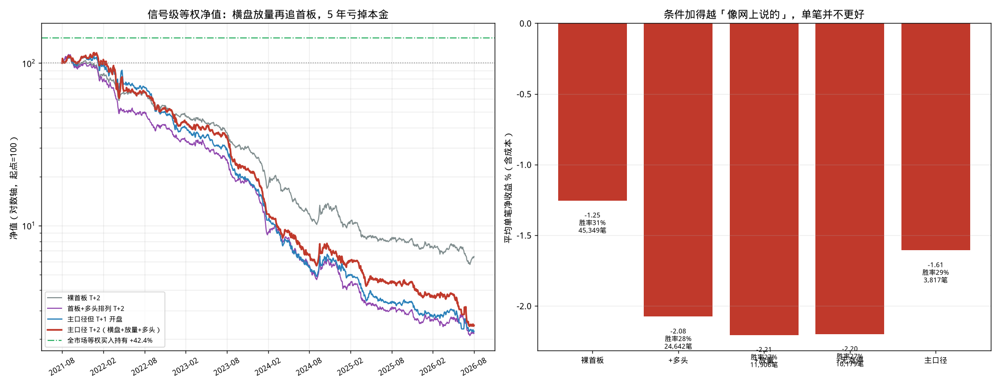

# 专项回测：横盘放量后追第一个涨停

> 策略原话：横盘超过 20 个交易日，突然放量上涨，当前价大于五日线大于十日线大于二十日线，在第一个涨停后的第二个交易日开盘开始介入，跌破十日线离场。

公开资料没有统一公式。下面把每句话落到日线，不含未来函数。

**主口径**

| 环节 | 量化 |
| --- | --- |
| 第一个涨停 | 当日收盘涨停（板块上限 + 收盘=最高价），且昨日不是涨停 |
| 横盘超过 20 日 | 涨停前 20 个交易日（不含涨停当日）最高价−最低价，相对最低价 **&lt; 15%**；这 20 日里没有涨停 |
| 突然放量上涨 | 涨停当日成交量 &gt; 涨停前 5 日均量的 **2 倍**（涨停本身就是上涨） |
| 均线多头 | 涨停收盘 **C &gt; MA5 &gt; MA10 &gt; MA20** |
| 买入 | 涨停日为 T，**T+2 开盘**（「涨停后的第二个交易日」；T+1 是其后第一个交易日） |
| 卖出 | 收盘跌破 MA10，次日开盘卖 |

页面中文编译器表达不了「横盘箱体」和「信号日与成交日再隔一天」，**不进策略库**，避免页面里点出来变成涨停次日买。

**结论先说：** 3,817 笔，胜率 28.8%，平均单笔 **−1.61%**，等权 5 年 **−97.6%**。样本内 −2.14%、样本外 −1.04%。涨停收盘已经比 MA10 高约 12%，再等两天开盘买，等于买在冲高之后，跌破 10 日线离场把均值回归走完。横盘、放量、多头排列都救不了。

---

## 一、口径

| 项目 | 设定 |
| --- | --- |
| 样本 | 全 A 股 5,404 只、657 万根前复权日线 |
| 区间 | 2021-08-17 ~ 2026-08-17（1,211 个交易日） |
| 涨停 | 主板 ≥9.5% / 创业板科创板 ≥19.5% / 北交所 ≥29.5%，且收盘=最高价 |
| 撮合 | T+2 开盘买、跌破 MA10 的次日开盘卖；一字板不成交；T+1 |
| 成本 | 手续费 0.5‰ + 滑点 0.5‰，双边 |
| 基准 | 全市场等权买入持有 5 年 **+42.41%** |

引擎验证例：000001 平安银行 2024-02-21 涨停（箱体 13.1%，量比 2.99，多头排列），02-23 开盘为买入日。

---

## 二、主口径结果

区间内涨停收盘 73,960 次，其中首板 57,560。一层层加上用户条件后，剩下 **3,899** 个事件（2,394 只）；T+2 能开盘成交 3,814（97.8%）。

| 指标 | 数值 |
| --- | --- |
| 成交 | 3,817 笔 |
| 胜率 | **28.77%** |
| 平均单笔 | **−1.61%**（中位数 −3.21%） |
| 盈亏比 | 0.64 |
| 平均盈利 / 平均亏损 | +9.79% / −6.21% |
| 平均持有 | 7.0 日（中位 6 日） |
| 等权 5 年 | **−97.57%**（年化 −52.7%，最大回撤 97.9%，夏普 −2.19） |
| T+2 开盘相对涨停收盘 | 均值 +1.00%，中位数 **−0.67%**，仍为正仅 43% |
| 涨停收盘相对 MA10 | 均值 **+11.52%** |

卖出几乎全是跌破 MA10（3,796），不是到期。资金约束 1000 万 / 单笔 5% / 最多 20 只：成交额优先 −89.7%，随机 −90.1%。

| 年份 | 笔数 | 胜率 | 平均单笔 |
| ---: | ---: | ---: | ---: |
| 2021 | 348 | 36.5% | +0.79% |
| 2022 | 614 | 25.7% | −2.75% |
| 2023 | 800 | 26.6% | −2.03% |
| 2024 | 451 | 27.9% | −1.85% |
| 2025 | 1,192 | 28.8% | −1.74% |
| 2026 | 412 | 31.8% | −0.44% |
| 样本内 ～2024-08-16 | 1,964 | 27.3% | **−2.14%** |
| 样本外 2024-08-17～ | 1,853 | 30.3% | **−1.04%** |

只有 2021 年单笔略正，其余年份全负。2025 年信号特别多（1,231 次），平均照样 −1.74%。

---

## 三、为什么结构上就亏

1. **买点已经离开 10 日线。** 涨停收盘相对 MA10 中位数 +10.7%。出场是「跌破 MA10」，等于要求这一段延伸继续走完，再把涨停幅度吐回去才走。和策略 31「三连板后回踩 10 日线」是同一类错位：入场时已经远离卖出均线。
2. **T+2 并不是更便宜的回踩。** 相对涨停收盘，T+2 开盘中位数已经低开 0.67%，但仍比 MA10 高一截；17.3% 的标的 T+1 还在涨停，T+2 开盘经常接到加速或开板后的溢价。
3. **横盘过滤没有改变收益符号。** 箱体越紧，单笔略好（10% 箱体 −1.25% vs 25% 箱体 −2.07%），仍然为负。放量 1.5× / 2× / 3× 差别很小。

---

## 四、对照：加条件、改时点、换出场

从裸首板往上加用户的每一句话（出场都是跌破 MA10）：

| 规则 | 笔数 | 胜率 | 平均单笔 | 等权 5 年 |
| --- | ---: | ---: | ---: | ---: |
| 裸首板 T+2 | 45,349 | 31.1% | −1.25% | −93.6% |
| +多头排列 | 24,642 | 27.6% | −2.08% | −97.8% |
| +放量 2 倍 | 11,906 | 27.4% | −2.21% | −97.0% |
| +20 日无涨停 | 10,179 | 27.2% | −2.20% | −96.6% |
| **+横盘 15%（主口径）** | **3,817** | **28.8%** | **−1.61%** | **−97.6%** |

多头排列和放量让单笔更差：选出的更是「已经拉升的强势票」。横盘只是把样本变少，没有翻正。

同一主口径，只改买入日：

| 买入 | 平均单笔 | 等权 5 年 |
| --- | ---: | ---: |
| T+1 开盘（涨停次日） | −2.34% | −97.8% |
| **T+2 开盘（原话）** | **−1.61%** | **−97.6%** |
| T+3 开盘 | −1.41% | −97.9% |

越晚买单笔亏得略少（少吃一段高开回落），但净值仍然归零。策略 26「涨停次日跟进」平均 −1.23%、5 年 −97.8%，同一量级。

换出场也翻不了盘：跌破 MA5 平均 −1.00%；止盈 8% / 止损 5% / 最长 10 日 −0.38%；持有满 5 日 −0.84%；收盘不涨停就卖 −0.62%。

箱体 10% / 收盘波幅 12% / 30 日箱体 20% / 用含当日均量的「放量」，平均单笔都在 −1.2%～−1.9%。

---

## 五、结论

1. **按原话做，全市场 5 年是稳定的负期望。** 3,817 笔足够大，样本内外同号，不是某一年的噪音。
2. **亏在买点：首板已经远离 10 日线，再隔一天开盘买，卖点却是均线回撤。** 横盘和放量选出的是「蓄势后的强突破」，突破后的次次日开盘在 A 股里并没有正的隔夜/次日溢价。
3. 不要把「箱体再紧一点、放量再大一点」当成优化方向——敏感度里全部为负。
4. 页面策略库不加这条近似规则。复跑：`python3 run_sideways_lu.py && python3 make_chart_sideways_lu.py`。

逐笔与变体：[`results/34_横盘放量首板T2_signal_trades.csv`](results/34_横盘放量首板T2_signal_trades.csv)、[`results/sideways_lu_variants.csv`](results/sideways_lu_variants.csv)。
